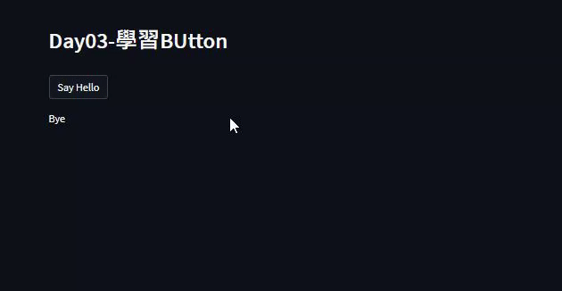

# Day03 認識Button

## 重點
+ 使用`st.header`建立標題
+ 使用`st.write`印出文字
+ 使用`st.button`按鈕改變印出文字


## 範例
```python
import streamlit as st

st.header('st.button')

if st.button('Say hello'):
     st.write('Why hello there')
else:
     st.write('Goodbye')
```

## 說明


+ 程式預設會顯示 Goodbye
+ 按下之後會顯示 hello

## 嘗試與疑問
+ 重新整理之後會回到Goodbye，那對於Streamlit來說初始化的時間點？
+ 這個程式只能單向切換過去，要如何做到來回切換？


## 延伸閱讀
+ [st.button - Streamlit Docs](https://docs.streamlit.io/library/api-reference/widgets/st.button)