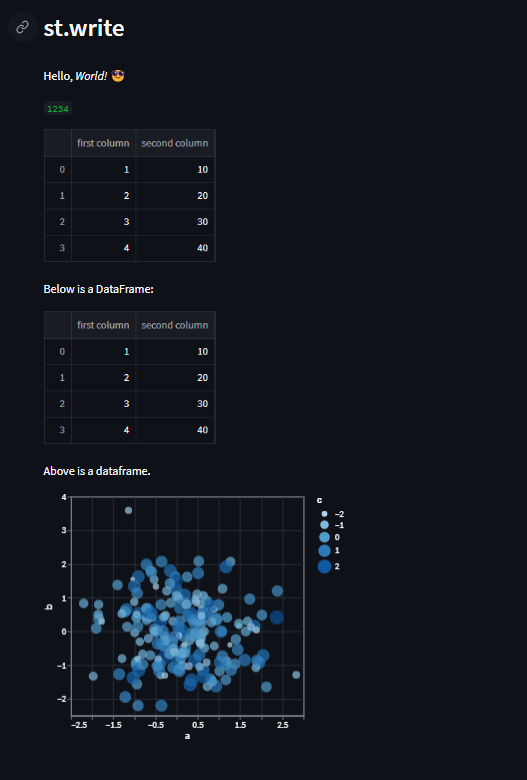

# Day05-st.write

## 重點
+ `st.write`可以讓我們顯示文字或是變數

### 可以寫入什麼？
+ 文字：例如`st.markdown()`
+ 物件：例如python `dict`
+ 資料幀：例如`pandas`
+ 圖片：例如`matplotlib`, `plotly`, `altair`, `graphviz`, `bokeh`
+ 其他，見[st.write on API docs](https://docs.streamlit.io/library/api-reference/write-magic/st.write)

## 範例
```python
import numpy as np
import altair as alt
import pandas as pd
import streamlit as st

st.header('st.write')

# Example 1

st.write('Hello, *World!* :sunglasses:')

# Example 2

st.write(1234)

# Example 3

df = pd.DataFrame({
     'first column': [1, 2, 3, 4],
     'second column': [10, 20, 30, 40]
     })
st.write(df)

# Example 4

st.write('Below is a DataFrame:', df, 'Above is a dataframe.')

# Example 5

df2 = pd.DataFrame(
     np.random.randn(200, 3),
     columns=['a', 'b', 'c'])
c = alt.Chart(df2).mark_circle().encode(
     x='a', y='b', size='c', color='c', tooltip=['a', 'b', 'c'])
st.write(c)
```

## 說明


### Example 1：文字
```python
st.write('Hello, *World!* :sunglasses:')
```
+ 支援Markdown斜體表示
+ 可以使用emoji

### Example 2：變數
```python
st.write(1234)
```
+ 數字會用不同的格式顯示出來

### Example 3：DataFrame
```python
df = pd.DataFrame({
     'first column': [1, 2, 3, 4],
     'second column': [10, 20, 30, 40]
     })
st.write(df)
```
+ 標題欄位名稱會做變色，很貼心~

### Example 4：組合複數個內容
```python
st.write('Below is a DataFrame:', df, 'Above is a dataframe.')
```
+ 像是`print`一樣，也可以直接給複數個要印出的對象

# Example 5：顯示繪圖(以`altair`為例)
```python
df2 = pd.DataFrame(
     np.random.randn(200, 3),
     columns=['a', 'b', 'c'])
c = alt.Chart(df2).mark_circle().encode(
     x='a', y='b', size='c', color='c', tooltip=['a', 'b', 'c'])
st.write(c)
```

## 嘗試與疑問
+ Python的`print`是怎麼寫的可以做到支援不同長度的參數呼叫？
+ 支援的這些繪圖套件：`matplotlib`, `plotly`, `altair`, `graphviz`, `bokeh`，各自有什麼特性或適合的場合？