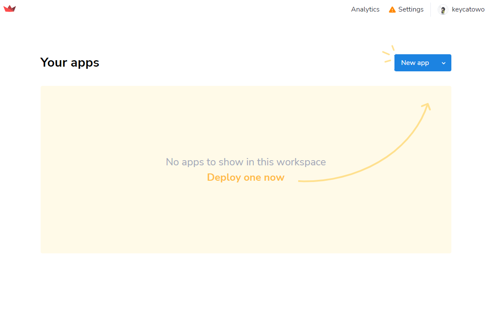
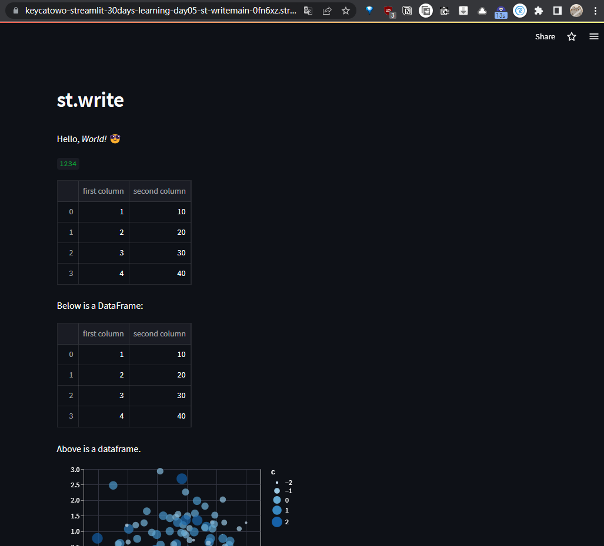

# Day07-使用Streamlit Cloud部署app

## 使用步驟
+ 先到[Cloud • Streamlit](https://streamlit.io/cloud)註冊帳號
+ 選擇建立App
+ 連線Github帳號或是直接貼上對應的Github檔案連結
+ 等待它跑一下
+ 結果：https://keycatowo-streamlit-30days-learning-day05-st-writemain-0fn6xz.streamlit.app/

