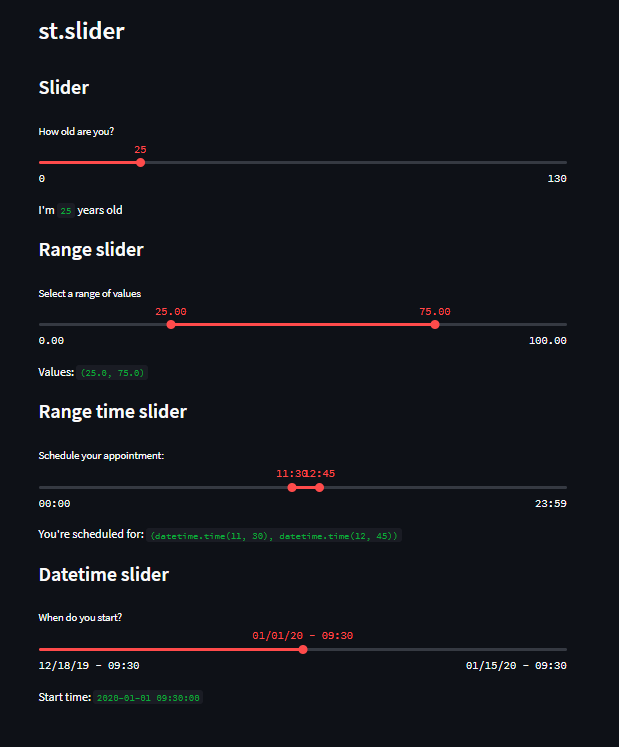

# Day08-st.slider

## 重點
+ 使用`st.subheader`建立子標題
+ 使用`st.slider`可以讓我們獲取一個可以調整的參數作為輸入
+ 支援以下格式
    + int
    + float
    + date
    + time
    + datetime


## 範例
```python
import streamlit as st
from datetime import time, datetime

st.header('st.slider')

# Example 1

st.subheader('Slider')

age = st.slider('How old are you?', 0, 130, 25)
st.write("I'm ", age, 'years old')

# Example 2

st.subheader('Range slider')

values = st.slider(
     'Select a range of values',
     0.0, 100.0, (25.0, 75.0))
st.write('Values:', values)

# Example 3

st.subheader('Range time slider')

appointment = st.slider(
     "Schedule your appointment:",
     value=(time(11, 30), time(12, 45)))
st.write("You're scheduled for:", appointment)

# Example 4

st.subheader('Datetime slider')

start_time = st.slider(
     "When do you start?",
     value=datetime(2020, 1, 1, 9, 30),
     format="MM/DD/YY - hh:mm")
st.write("Start time:", start_time)
```


## 說明


### Example 1：Slider
```python
age = st.slider('How old are you?', 0, 130, 25) # minimum, maximum, default
st.write("I'm ", age, 'years old')
```
+ 語法：`st.slider(顯示文字, 最小值, 最大值, 預設值)`

### Example 2：Range Slider
```python
values = st.slider(
     'Select a range of values',
     0.0, 100.0, (25.0, 75.0))
st.write('Values:', values)
```
+ 預設值傳入一個`tuple`，則會變成範圍選擇

### Example 3：Rande Time Slider
```python
appointment = st.slider(
     "Schedule your appointment:",
     value=(time(11, 30), time(12, 45)))
st.write("You're scheduled for:", appointment)
```
+ 語法：`st.slider(顯示文字, value=(time(hh,mm), time(hh,mm)))`
+ 回傳為一個tuple
    + `datetime.time, datetime.time`

### Example 4：Datetime Slider
```python
start_time = st.slider(
     "When do you start?",
     value=datetime(2020, 1, 1, 9, 30),
     format="MM/DD/YY - hh:mm")
st.write("Start time:", start_time)
```
+ 參數
    + `format`：日期格式，例如`YY-MM-DD hh:mm`


## 延伸閱讀
+ [st.select_slider - Streamlit Docs](https://docs.streamlit.io/library/api-reference/widgets/st.select_slider)