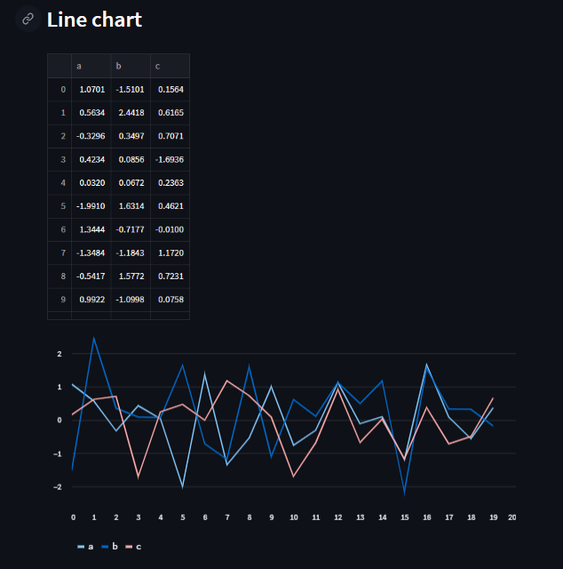

# Day09-st.line_chart

## 重點
+ 使用`st.line_chart`繪製線段圖
+ 其為`st.altair_chart`的語法糖(syntax-sugar)
    + 主要差別為使用資料自己的col和index定義
    + 適合用在單純印出來這張圖(Just plot this)的情況
+ 如果是`st.line_chart`繪製出問題的時候，請使用`st.altair_chart`

## 範例
```python
import streamlit as st
import pandas as pd
import numpy as np

st.header('Line chart')

chart_data = pd.DataFrame(
     np.random.randn(20, 3),
     columns=['a', 'b', 'c'])

st.line_chart(chart_data)
```

## 說明


```python
chart_data = pd.DataFrame(
     np.random.randn(20, 3),
     columns=['a', 'b', 'c'])

st.line_chart(chart_data)
```
+ 預設會自動把不同欄位的值視為不同的label


## 疑問
+ 如何透過`st.altair_chart`繪製出一樣的結果？

## 延伸閱讀
+ [st.line_chart - Streamlit Docs](https://docs.streamlit.io/library/api-reference/charts/st.line_chart)
+ [st.altair_chart - Streamlit Docs](https://docs.streamlit.io/library/api-reference/charts/st.altair_chart)