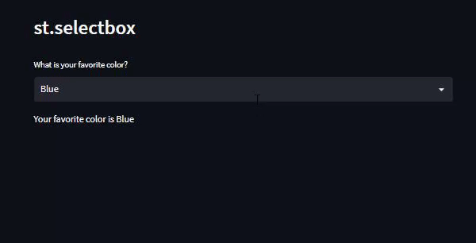

# Day10-st.selectbox

## 重點
+ 使用`st.selectbox`選擇選項

## 範例
```python
import streamlit as st

st.header('st.selectbox')

option = st.selectbox(
     'What is your favorite color?',
     ('Blue', 'Red', 'Green'))

st.write('Your favorite color is ', option)
```

## 說明


```python
option = st.selectbox(
     'What is your favorite color?',
     ('Blue', 'Red', 'Green'))
```
+ `st.selectbox`的第一個參數為顯示的文字
+ `st.selectbox`的第二個參數為選項
    + 可以是list或tuple


## 延伸閱讀
+ [st.selectbox - Streamlit Docs](https://docs.streamlit.io/library/api-reference/widgets/st.selectbox)