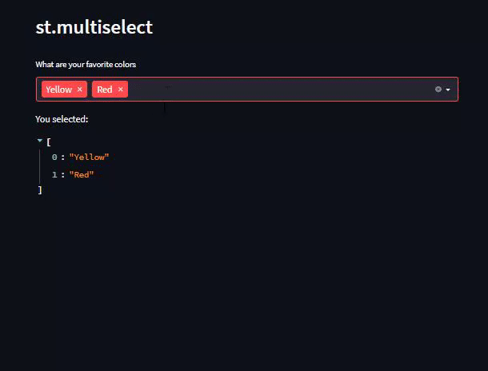

# Day11-st.multiselect

## 重點
+ 使用`st.multiselect`選擇選項


## 範例
```python
import streamlit as st

st.header('st.multiselect')

options = st.multiselect(
     'What are your favorite colors',
     ['Green', 'Yellow', 'Red', 'Blue'],
     ['Yellow', 'Red'])

st.write('You selected:', options)
```

## 說明


```python
options = st.multiselect(
     'What are your favorite colors',
     ['Green', 'Yellow', 'Red', 'Blue'],
     ['Yellow', 'Red'])
```
+ `st.multiselect`的第一個參數為顯示的文字
+ `st.multiselect`的第二個參數為選項，表示可以選的範圍
    + 可以是list或tuple
+ `st.multiselect`的第三個參數為預設選項，表示預設選擇的選項

## 延伸閱讀
+ [st.multiselect - Streamlit Docs](https://docs.streamlit.io/library/api-reference/widgets/st.multiselect)