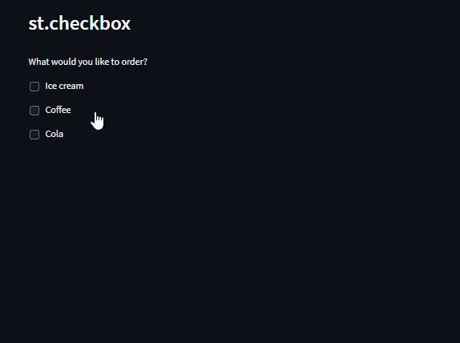

# Day12-st.checkbox

## 重點
+ 使用`st.checkbox`選擇選項


## 範例
```python
import streamlit as st

st.header('st.checkbox')

st.write ('What would you like to order?')

icecream = st.checkbox('Ice cream')
coffee = st.checkbox('Coffee')
cola = st.checkbox('Cola')

if icecream:
     st.write("Great! Here's some more 🍦")

if coffee: 
     st.write("Okay, here's some coffee ☕")

if cola:
     st.write("Here you go 🥤")
```

## 說明


```python
icecream = st.checkbox('Ice cream')
```
+ `st.checkbox`的第一個參數為顯示的文字
+ 回傳值為`True`或`False`


## 延伸閱讀
+ [st.checkbox - Streamlit Docs](https://docs.streamlit.io/library/api-reference/widgets/st.checkbox)