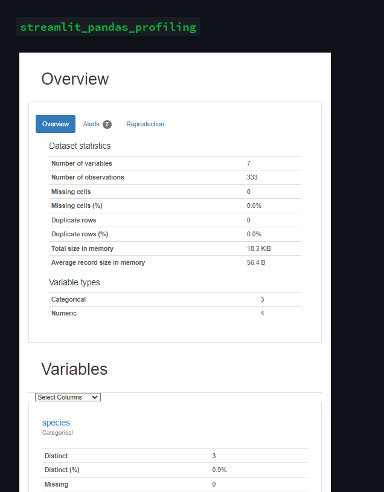

# Day14-Streamlit Components

## 重點
+ 使用`pandas_profiling`套件產生資料分析報告


## 範例
```python
import streamlit as st
import pandas as pd
import pandas_profiling
from streamlit_pandas_profiling import st_profile_report

st.header('`streamlit_pandas_profiling`')

df = pd.read_csv('https://raw.githubusercontent.com/dataprofessor/data/master/penguins_cleaned.csv')

pr = df.profile_report()
st_profile_report(pr)
```


## 說明


```python
pr = df.profile_report()
st_profile_report(pr)
```
+ `df.profile_report()`產生資料分析報告
    + 其中pr為`<class 'pandas_profiling.profile_report.ProfileReport'>`物件
+ `st_profile_report(pr)`將資料分析報告顯示在網頁上

## 延伸閱讀
### 製作自己的Streamlit Components
+ [Create a Component - Streamlit Docs](https://docs.streamlit.io/library/components/create)
+ [Publish a Component - Streamlit Docs](https://docs.streamlit.io/library/components/publish)
+ [Components API - Streamlit Docs](https://docs.streamlit.io/library/components/components-api)
+ [Add and Share Custom App Functionality | Streamlit Components](https://blog.streamlit.io/introducing-streamlit-components/)

### 其他關於Streamlit Components的文章
+ [Components - Streamlit Docs](https://docs.streamlit.io/library/components)
+ [Components • Streamlit](https://streamlit.io/components)
+ [Streamlit Components - Community Tracker - Streamlit Components - Streamlit](https://discuss.streamlit.io/t/streamlit-components-community-tracker/4634)
+ [Streamlit Gallery by Okld · Streamlit](https://okld-gallery.streamlit.app/?p=pandas-profiling)
