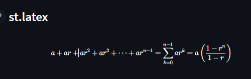

# Day15-st.latex

## 重點
+ 使用`st.latex`顯示LaTeX數學公式

## 範例
```python
import streamlit as st

st.header('st.latex')

st.latex(r'''
     a + ar + a r^2 + a r^3 + \cdots + a r^{n-1} =
     \sum_{k=0}^{n-1} ar^k =
     a \left(\frac{1-r^{n}}{1-r}\right)
     ''')
```

## 說明


```python
st.latex(r'''
     a + ar + a r^2 + a r^3 + \cdots + a r^{n-1} =
     \sum_{k=0}^{n-1} ar^k =
     a \left(\frac{1-r^{n}}{1-r}\right)
     ''')
```
+ `st.latex`顯示LaTeX數學公式
    + 其中`r`為原始字串
    + 其中`\frac{1-r^{n}}{1-r}`為LaTeX數學公式

## 延伸閱讀
+ [st.latex - Streamlit Docs](https://docs.streamlit.io/library/api-reference/text/st.latex)
+ [LaTeX - Wikipedia](https://en.wikipedia.org/wiki/LaTeX)
+ [LaTeX - Overleaf, Online LaTeX Editor](https://www.overleaf.com/learn/latex/Learn_LaTeX_in_30_minutes)
