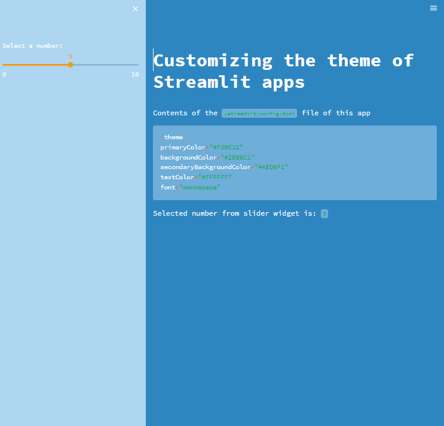

# Day16-客製化主題

## 重點
+ 我們可以透過修改`config.toml`來客製化主題
    + `config.toml`的位置在`~/.streamlit/config.toml`

## 範例
```python
import streamlit as st

st.title('Customizing the theme of Streamlit apps')

st.write('Contents of the `.streamlit/config.toml` file of this app')

st.code("""
[theme]
primaryColor="#F39C12"
backgroundColor="#2E86C1"
secondaryBackgroundColor="#AED6F1"
textColor="#FFFFFF"
font="monospace"
""")

number = st.sidebar.slider('Select a number:', 0, 10, 5)
st.write('Selected number from slider widget is:', number)
```

## 說明


## 嘗試和疑問
+ 有嘗試分別在`~/.streamlit/config.toml`和`./.streamlit/config.toml`放入`config.toml`都有作用，但是不知道哪個比較好，或是有優先度之分？

## 延伸閱讀
+ [Theming - Streamlit Docs](https://docs.streamlit.io/library/advanced-features/theming)
+ [HTML Color Codes](https://htmlcolorcodes.com/)