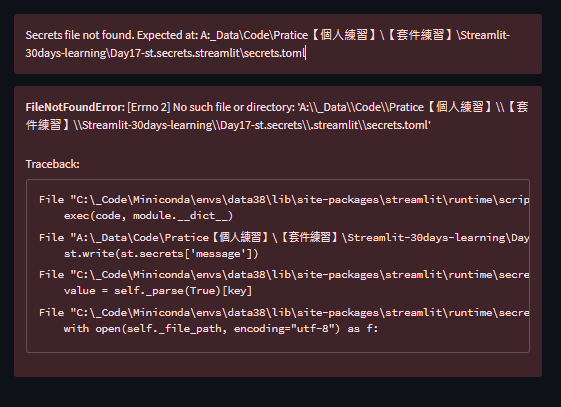

# Day17-st.secrets

## 重點
+ 透過`st.secrets`，可以讓使用者在本地端設定一些資訊，並在程式中讀取
+ 適用在安全性考量，例如DB的帳號密碼，可以透過`secrets.toml`來設定
+ `secrets.toml`的內容不會被上傳到Streamlit Cloud
+ ❗：開發的時候，請記得將`secrets.toml`加入`.gitignore`，避免上傳到GitHub

## 範例
```python
import streamlit as st

st.title('st.secrets')
st.write(st.secrets['message'])
```

```toml
# secrets.toml
message = "This is a secreat message"

[collection]
message = "This is another secreat message"
```

## 說明

+ 使用`st.secrets`可以讀取`secrets.toml`的內容
+ toml的格式，可以使用`[collection]`來分類
    + collection的名稱不能有空白

## 問題排解
### 缺少`secrets.toml`的設定檔

+ 可以透過添加`secrets.toml`的方式來解決


## 延伸閱讀
+ [Secrets Management & Securely Connect to Private Data Sources](https://blog.streamlit.io/secrets-in-sharing-apps/)
+ [Secrets management - Streamlit Docs](https://docs.streamlit.io/streamlit-cloud/get-started/deploy-an-app/connect-to-data-sources/secrets-management)