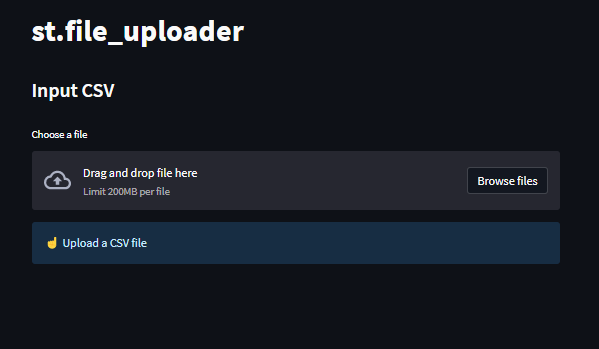

# Day18-st.file_uploader

## 重點
+ 使用 `st.file_uploader` 來上傳檔案

## 範例
```python
import streamlit as st
import pandas as pd

st.title('st.file_uploader')

st.subheader('Input CSV')
uploaded_file = st.file_uploader("Choose a file")

if uploaded_file is not None:
  df = pd.read_csv(uploaded_file)
  st.subheader('DataFrame')
  st.write(df)
  st.subheader('Descriptive Statistics')
  st.write(df.describe())
else:
  st.info('☝️ Upload a CSV file')
```

## 說明


```python
uploaded_file = st.file_uploader("Choose a file")
```
+ 建立檔案上傳區

```python
if uploaded_file is not None:
  df = pd.read_csv(uploaded_file)
  st.subheader('DataFrame')
  st.write(df)
  st.subheader('Descriptive Statistics')
  st.write(df.describe())
else:
  st.info('☝️ Upload a CSV file')
```
+ 如果有上傳檔案，則讀取檔案並顯示資料
+ 如果沒有上傳檔案，則顯示提示訊息

## 延伸閱讀
+ [st.file_uploader - Streamlit Docs](https://docs.streamlit.io/library/api-reference/widgets/st.file_uploader)
+ [Configuration - Streamlit Docs](https://docs.streamlit.io/library/advanced-features/configuration#set-configuration-options)