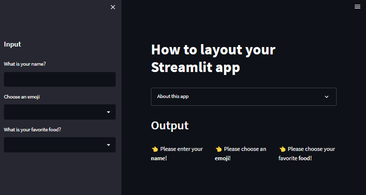

# Day19-調整Layout

## 重點
+ `st.set_page_config(layout="wide")`:調整頁面寬度wide(預設為fixed寬度)
+ `st.sidebar`：放置在左側的sidebar
+ `st.expander`：放置文字或圖片在一個可以折疊的容器中
+ `st.columns`：建立一個Tabular空間，可以放置多個元件


## 範例
```python
import streamlit as st

st.set_page_config(layout="wide")

st.title('How to layout your Streamlit app')

with st.expander('About this app'):
  st.write('This app shows the various ways on how you can layout your Streamlit app.')
  st.image('https://streamlit.io/images/brand/streamlit-logo-secondary-colormark-darktext.png', width=250)

st.sidebar.header('Input')
user_name = st.sidebar.text_input('What is your name?')
user_emoji = st.sidebar.selectbox('Choose an emoji', ['', '😄', '😆', '😊', '😍', '😴', '😕', '😱'])
user_food = st.sidebar.selectbox('What is your favorite food?', ['', 'Tom Yum Kung', 'Burrito', 'Lasagna', 'Hamburger', 'Pizza'])

st.header('Output')

col1, col2, col3 = st.columns(3)

with col1:
  if user_name != '':
    st.write(f'👋 Hello {user_name}!')
  else:
    st.write('👈  Please enter your **name**!')

with col2:
  if user_emoji != '':
    st.write(f'{user_emoji} is your favorite **emoji**!')
  else:
    st.write('👈 Please choose an **emoji**!')

with col3:
  if user_food != '':
    st.write(f'🍴 **{user_food}** is your favorite **food**!')
  else:
    st.write('👈 Please choose your favorite **food**!')
```

## 說明


### 設定頁面寬度
```python
st.set_page_config(layout="wide")
```

### 放置在左側的sidebar
```python
st.sidebar.header('Input')
user_name = st.sidebar.text_input('What is your name?')
user_emoji = st.sidebar.selectbox('Choose an emoji', ['', '😄', '😆', '😊', '😍', '😴', '😕', '😱'])
user_food = st.sidebar.selectbox('What is your favorite food?', ['', 'Tom Yum Kung', 'Burrito', 'Lasagna', 'Hamburger', 'Pizza'])
```
+ `st.sidebar.header()`：類似於`st.header()`，但是放置在左側的sidebar

### 放置文字或圖片在一個可以折疊的容器中
```python
with st.expander('About this app'):
  st.write('This app shows the various ways on how you can layout your Streamlit app.')
  st.image('https://streamlit.io/images/brand/streamlit-logo-secondary-colormark-darktext.png', width=250)
```
+ 搭配`with`語法使用
+ 要折疊的文字或圖片放在`with`內


### 建立多欄空間
```python
col1, col2, col3 = st.columns(3)

with col1:
  if user_name != '':
    st.write(f'👋 Hello {user_name}!')
  else:
    st.write('👈  Please enter your **name**!')

with col2:
  if user_emoji != '':
    st.write(f'{user_emoji} is your favorite **emoji**!')
  else:
    st.write('👈 Please choose an **emoji**!')

with col3:
  if user_food != '':
    st.write(f'🍴 **{user_food}** is your favorite **food**!')
  else:
    st.write('👈 Please choose your favorite **food**!')
```
+ `st.columns(N)`：建立複數個欄位，並且指定欄位數量
    + `col1, col2, col3 = st.columns(3)`：將欄位指定給變數
+ `with col1:`：將元件放置在欄位中


## 嘗試與疑問
+ `st.set_page_config(layout="wide")`的效果是什麼？
    + 有拿掉之後，發現沒有差別
+ 要使用`with`語法，才能使用`st.expander()`嗎？
    + Copilot: 不是，可以直接使用`st.expander()`，但是要注意，如果沒有使用`with`語法，則會把所有元件都放在一個折疊的容器中


## 延伸閱讀
+ [Layouts and Containers - Streamlit Docs](https://docs.streamlit.io/library/api-reference/layout)