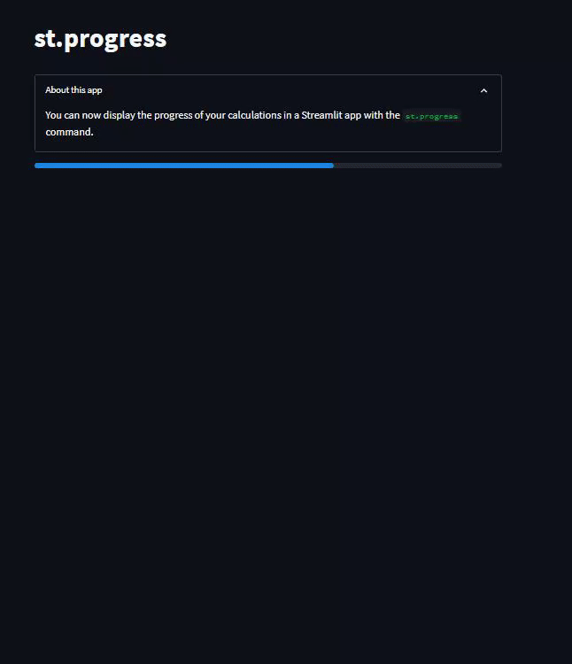

# Day21-st.progress

## 重點
+ `st.progress()`：顯示進度條
+ `st.balloons()`：顯示氣球特效

## 範例
```python
import streamlit as st
import time

st.title('st.progress')

with st.expander('About this app'):
     st.write('You can now display the progress of your calculations in a Streamlit app with the `st.progress` command.')

my_bar = st.progress(0)

for percent_complete in range(100):
     time.sleep(0.05)
     my_bar.progress(percent_complete + 1)

st.balloons()
```

## 說明


```python
my_bar = st.progress(0)

for percent_complete in range(100):
     time.sleep(0.05)
     my_bar.progress(percent_complete + 1)
```
+ `my_bar = st.progress(0)`：建立一個進度條，並且設定初始值為0
+ `my_bar.progress(percent_complete + 1)`：更新進度條的值


## 嘗試與疑問
+ 是否有其他類似`st.ballons()`的特效？
+ 非百分制的進度條如何顯示？是否要自行換算？


## 延伸閱讀
+ [st.progress - Streamlit Docs](https://docs.streamlit.io/library/api-reference/status/st.progress)