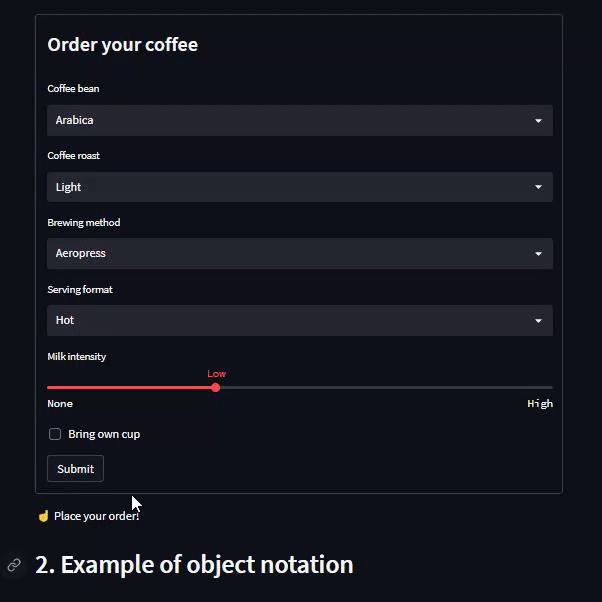

# Day22-st.form

## 重點
+ 使用`st.form`來建立表單，用來批次處理多個元件
    + 因為一般情況下當用戶與一個元件互動的時候，其他元件都會重新渲染，這樣會造成效能上的浪費
    + 但是使用`st.form`可以將多個元件包裝起來，當手動按下`Submit`按鈕的時候，才會一起重新渲染
+ 使用`st.form`的限制：
    + 一個`st.form`必須且只能包含一個`st.form_submit_button`元件
    + 不能包含`st.button`、`st.download_button`
    + 表單可以放在任何地方，但不能被放在其他表單裡面


## 範例
```python
import streamlit as st

st.title('st.form')

# Full example of using the with notation
st.header('1. Example of using `with` notation')
st.subheader('Coffee machine')

with st.form('my_form'):
    st.subheader('**Order your coffee**')

    # Input widgets
    coffee_bean_val = st.selectbox('Coffee bean', ['Arabica', 'Robusta'])
    coffee_roast_val = st.selectbox('Coffee roast', ['Light', 'Medium', 'Dark'])
    brewing_val = st.selectbox('Brewing method', ['Aeropress', 'Drip', 'French press', 'Moka pot', 'Siphon'])
    serving_type_val = st.selectbox('Serving format', ['Hot', 'Iced', 'Frappe'])
    milk_val = st.select_slider('Milk intensity', ['None', 'Low', 'Medium', 'High'])
    owncup_val = st.checkbox('Bring own cup')

    # Every form must have a submit button
    submitted = st.form_submit_button('Submit')

if submitted:
    st.markdown(f'''
        ☕ You have ordered:
        - Coffee bean: `{coffee_bean_val}`
        - Coffee roast: `{coffee_roast_val}`
        - Brewing: `{brewing_val}`
        - Serving type: `{serving_type_val}`
        - Milk: `{milk_val}`
        - Bring own cup: `{owncup_val}`
        ''')
else:
    st.write('☝️ Place your order!')


# Short example of using an object notation
st.header('2. Example of object notation')

form = st.form('my_form_2')
selected_val = form.slider('Select a value')
form.form_submit_button('Submit')

st.write('Selected value: ', selected_val)
```

## 結果


### 寫法1：使用`with`語法
```python
with st.form('my_form'):
    st.subheader('**Order your coffee**')

    # Input widgets
    coffee_bean_val = st.selectbox('Coffee bean', ['Arabica', 'Robusta'])
    coffee_roast_val = st.selectbox('Coffee roast', ['Light', 'Medium', 'Dark'])
    brewing_val = st.selectbox('Brewing method', ['Aeropress', 'Drip', 'French press', 'Moka pot', 'Siphon'])
    serving_type_val = st.selectbox('Serving format', ['Hot', 'Iced', 'Frappe'])
    milk_val = st.select_slider('Milk intensity', ['None', 'Low', 'Medium', 'High'])
    owncup_val = st.checkbox('Bring own cup')

    # Every form must have a submit button
    submitted = st.form_submit_button('Submit')

if submitted:
    st.markdown(f'''
        ☕ You have ordered:
        - Coffee bean: `{coffee_bean_val}`
        - Coffee roast: `{coffee_roast_val}`
        - Brewing: `{brewing_val}`
        - Serving type: `{serving_type_val}`
        - Milk: `{milk_val}`
        - Bring own cup: `{owncup_val}`
        ''')
else:
    st.write('☝️ Place your order!')
```
+ 用`with`將所有表單元件包起來
    + 其中有一個`st.form_submit_button`元件，用來觸發表單的重新渲染
+ 在其他地方使用`if submitted`來判斷是否要重新渲染表單


### 寫法2：使用物件語法
```python
# Short example of using an object notation
st.header('2. Example of object notation')

form = st.form('my_form_2')
selected_val = form.slider('Select a value')
form.form_submit_button('Submit')

st.write('Selected value: ', selected_val)
```
+ 用`form = st.form('my_form_2')`建立一個表單物件
    + 用`form.slider('Select a value')`來在這個表單下建立一個滑桿元件
    + 用`form.form_submit_button('Submit')`來在這個表單下建立一個`Submit`按鈕
+ 不判斷是否觸發，而是讓要渲染的值自動更新

## 延伸閱讀
+ [st.form - Streamlit Docs](https://docs.streamlit.io/library/api-reference/control-flow/st.form)
+ [Batch Input Widgets | Introducing Submit Button & Forms](https://blog.streamlit.io/introducing-submit-button-and-forms/)