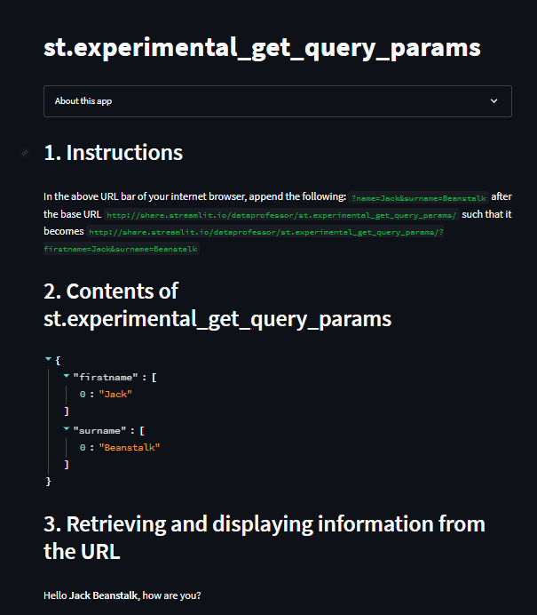

# Day23-st.experimental_get_query_params

## 重點
+ 使用`st.experimental_get_query_params()`取得網址列的參數


## 範例
```python
import streamlit as st

st.title('st.experimental_get_query_params')

with st.expander('About this app'):
  st.write("`st.experimental_get_query_params` allows the retrieval of query parameters directly from the URL of the user's browser.")

# 1. Instructions
st.header('1. Instructions')
st.markdown('''
In the above URL bar of your internet browser, append the following:
`?name=Jack&surname=Beanstalk`
after the base URL `http://share.streamlit.io/dataprofessor/st.experimental_get_query_params/`
such that it becomes 
`http://share.streamlit.io/dataprofessor/st.experimental_get_query_params/?firstname=Jack&surname=Beanstalk`
''')


# 2. Contents of st.experimental_get_query_params
st.header('2. Contents of st.experimental_get_query_params')
st.write(st.experimental_get_query_params())


# 3. Retrieving and displaying information from the URL
st.header('3. Retrieving and displaying information from the URL')

firstname = st.experimental_get_query_params()['firstname'][0]
surname = st.experimental_get_query_params()['surname'][0]

st.write(f'Hello **{firstname} {surname}**, how are you?')
```

## 說明
  
網址改成：`http://localhost:8501/?firstname=Jack&surname=Beanstalk`

```python
st.write(st.experimental_get_query_params()) 

firstname = st.experimental_get_query_params()['firstname'][0]
surname = st.experimental_get_query_params()['surname'][0]
```
+ `st.experimental_get_query_params()`會回傳一個字典，裡面包含網址列的參數
+ 透過`st.experimental_get_query_params()['firstname'][0]`取得`firstname`的值

## 延伸閱讀
+ [st.experimental_get_query_params - Streamlit Docs](https://docs.streamlit.io/library/api-reference/utilities/st.experimental_get_query_params)