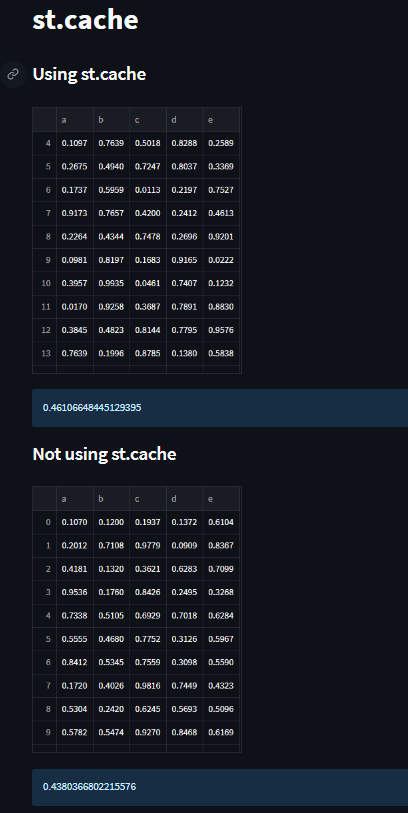

# Day24-st.cache

## 重點
+ 使用`st.cache`優化Streamlit的效能
    + 實際使用方式為`@st.cache`去包裝
+ 使用`st.info`印出提示文字

## 範例
```python
import streamlit as st
import numpy as np
import pandas as pd
from time import time

st.title('st.cache')

# Using cache
a0 = time()
st.subheader('Using st.cache')

@st.cache(suppress_st_warning=True)
def load_data_a():
  df = pd.DataFrame(
    np.random.rand(2000000, 5),
    columns=['a', 'b', 'c', 'd', 'e']
  )
  return df

st.write(load_data_a())
a1 = time()
st.info(a1-a0)


# Not using cache
b0 = time()
st.subheader('Not using st.cache')

def load_data_b():
  df = pd.DataFrame(
    np.random.rand(2000000, 5),
    columns=['a', 'b', 'c', 'd', 'e']
  )
  return df

st.write(load_data_b())
b1 = time()
st.info(b1-b0)
```

## 說明

```python
@st.cache(suppress_st_warning=True)
def load_data_a():
  df = pd.DataFrame(
    np.random.rand(1000000, 5),
    columns=['a', 'b', 'c', 'd', 'e']
  )
  return df

def load_data_b():
  df = pd.DataFrame(
    np.random.rand(1000000, 5),
    columns=['a', 'b', 'c', 'd', 'e']
  )
  return df
```
+ 建立一個函數回傳要印出的值


## 嘗試與疑問
+ `st.cache`裡面的`suppress_st_warning`表示什麼？
  + Copilot：這個參數是用來抑制Streamlit的警告訊息
  + 這個參數的預設值是`False`，所以會顯示警告訊息
  + 警告訊息的內容是`st.cache`的使用方式會影響到Streamlit的效能
+ 為什麼我嘗試的沒有使用cache的反而比較快？

## 延伸閱讀
+ [st.cache - Streamlit Docs](https://docs.streamlit.io/library/api-reference/performance/st.cache)
+ [Optimize performance with st.cache - Streamlit Docs](https://docs.streamlit.io/library/advanced-features/caching)
+ [Experimental cache primitives - Streamlit Docs](https://docs.streamlit.io/library/advanced-features/experimental-cache-primitives)
+ [st.experimental_memo - Streamlit Docs](https://docs.streamlit.io/library/api-reference/performance/st.experimental_memo)
+ [st.experimental_singleton - Streamlit Docs](https://docs.streamlit.io/library/api-reference/performance/st.experimental_singleton)