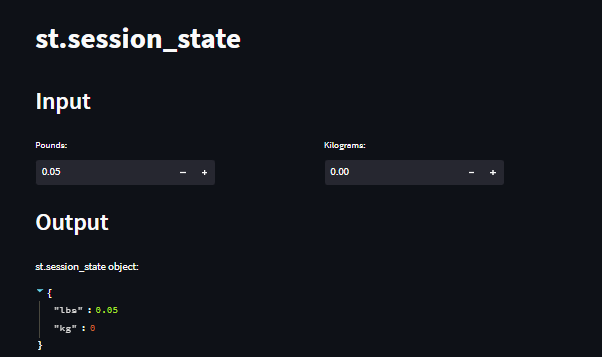

# Day25-st.session_state

## 重點
+ 在Streamlit中，每一個分頁都是一個獨立的程式，所以每一個分頁都有自己的變數
+ 當重新執行程式時，變數會被重置
+ `st.session_state`可以用來儲存資料，讓重新執行程式時，資料不會被重置

## 範例
```python
import streamlit as st

st.title('st.session_state')

def lbs_to_kg():
  st.session_state.kg = st.session_state.lbs/2.2046
def kg_to_lbs():
  st.session_state.lbs = st.session_state.kg*2.2046

st.header('Input')
col1, spacer, col2 = st.columns([2,1,2])
with col1:
  pounds = st.number_input("Pounds:", key = "lbs", on_change = lbs_to_kg)
with col2:
  kilogram = st.number_input("Kilograms:", key = "kg", on_change = kg_to_lbs)

st.header('Output')
st.write("st.session_state object:", st.session_state)
```

## 說明

### 建立不等長的分隔
```python
col1, spacer, col2 = st.columns([2,1,2])
```

### 使用`st.session_state`來儲存資料
```python
def lbs_to_kg():
  st.session_state.kg = st.session_state.lbs/2.2046
with col1:
  pounds = st.number_input("Pounds:", key = "lbs", on_change = lbs_to_kg)
```
+ `st.session_state`是一個字典，可以用來儲存資料
+ `on_change`：當使用者輸入資料時，會自動執行`on_change`的函式
    + 當`lbs`改變時候，讓`kg`也跟著改變

## 延伸閱讀
+ [Session State - Streamlit Docs](https://docs.streamlit.io/library/api-reference/session-state)
+ [Add statefulness to apps - Streamlit Docs](https://docs.streamlit.io/library/advanced-features/session-state)
