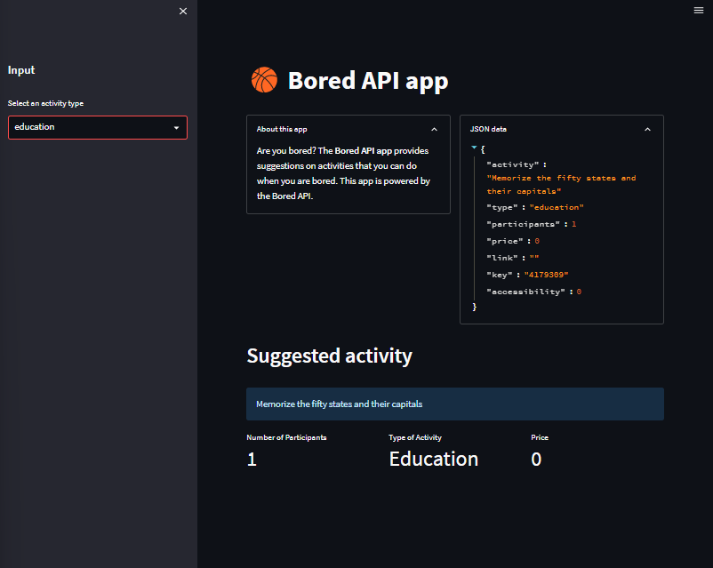

# Day26-API

## 重點
+ 在Streamlit中使用API
+ 使用`st.metric`顯示數值


## 範例
```python
import streamlit as st
import requests

st.title('🏀 Bored API app')

st.sidebar.header('Input')
selected_type = st.sidebar.selectbox('Select an activity type', ["education", "recreational", "social", "diy", "charity", "cooking", "relaxation", "music", "busywork"])

suggested_activity_url = f'http://www.boredapi.com/api/activity?type={selected_type}'
json_data = requests.get(suggested_activity_url)
suggested_activity = json_data.json()

c1, c2 = st.columns(2)
with c1:
  with st.expander('About this app'):
    st.write('Are you bored? The **Bored API app** provides suggestions on activities that you can do when you are bored. This app is powered by the Bored API.')
with c2:
  with st.expander('JSON data'):
    st.write(suggested_activity)

st.header('Suggested activity')
st.info(suggested_activity['activity'])

col1, col2, col3 = st.columns(3)
with col1:
  st.metric(label='Number of Participants', value=suggested_activity['participants'], delta='')
with col2:
  st.metric(label='Type of Activity', value=suggested_activity['type'].capitalize(), delta='')
with col3:
  st.metric(label='Price', value=suggested_activity['price'], delta='')
```

## 說明

### 取得API資料
```python
suggested_activity_url = f'http://www.boredapi.com/api/activity?type={selected_type}'
json_data = requests.get(suggested_activity_url)
suggested_activity = json_data.json()
```
+ `requests.get()`可以取得API資料
+ `json_data.json()`可以將API資料轉換成JSON格式

### 顯示資料
```python
st.info(suggested_activity['activity'])

col1, col2, col3 = st.columns(3)
with col1:
  st.metric(label='Number of Participants', value=suggested_activity['participants'], delta='')
with col2:
  st.metric(label='Type of Activity', value=suggested_activity['type'].capitalize(), delta='')
with col3:
  st.metric(label='Price', value=suggested_activity['price'], delta='')
```
+ `st.info()`可以顯示資訊
+ `st.metric()`可以顯示數值
    + `label`是標籤
    + `value`是數值

## 嘗試與疑問
+ `st.metric`的`delta`參數是什麼意思？


## 延伸閱讀
+ [Bored API](http://www.boredapi.com/)