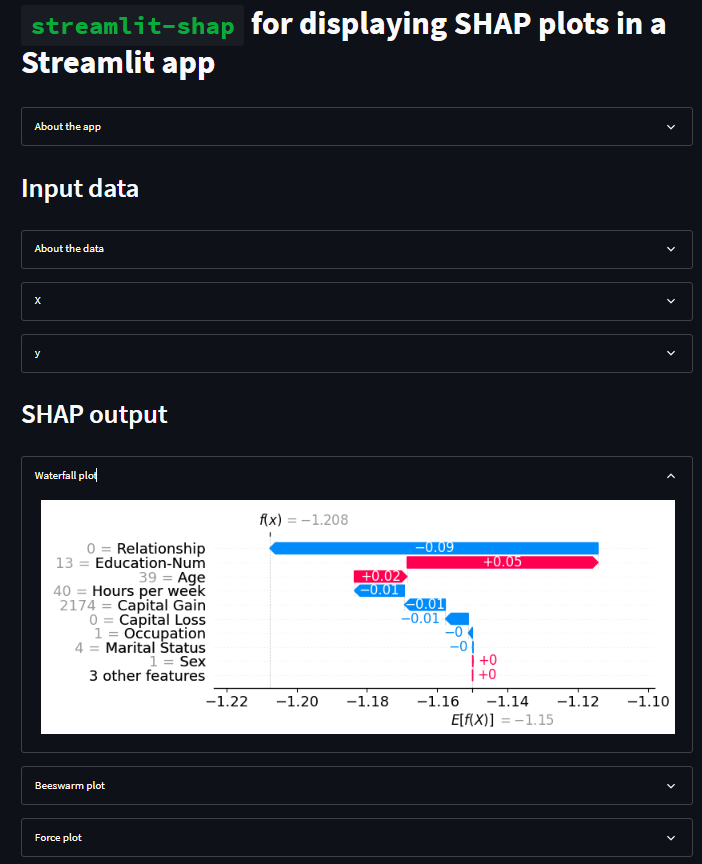

# Day28-streamlit-shap

## 重點
+ streamlit-shap 是一個 Streamlit component，提供了一個包裝器，用於在 Streamlit 中顯示 SHAP 圖表。
+ 

## 範例
```python
import streamlit as st
from streamlit_shap import st_shap
import shap
from sklearn.model_selection import train_test_split
import xgboost
import numpy as np
import pandas as pd

st.set_page_config(layout="wide")

@st.experimental_memo
def load_data():
    return shap.datasets.adult()

@st.experimental_memo
def load_model(X, y):
    X_train, X_test, y_train, y_test = train_test_split(X, y, test_size=0.2, random_state=7)
    d_train = xgboost.DMatrix(X_train, label=y_train)
    d_test = xgboost.DMatrix(X_test, label=y_test)
    params = {
        "eta": 0.01,
        "objective": "binary:logistic",
        "subsample": 0.5,
        "base_score": np.mean(y_train),
        "eval_metric": "logloss",
        "n_jobs": -1,
    }
    model = xgboost.train(params, d_train, 10, evals = [(d_test, "test")], verbose_eval=100, early_stopping_rounds=20)
    return model

st.title("`streamlit-shap` for displaying SHAP plots in a Streamlit app")

with st.expander('About the app'):
    st.markdown('''[`streamlit-shap`](https://github.com/snehankekre/streamlit-shap) is a Streamlit component that provides a wrapper to display [SHAP](https://github.com/slundberg/shap) plots in [Streamlit](https://streamlit.io/). 
                    The library is developed by our in-house staff [Snehan Kekre](https://github.com/snehankekre) who also maintains the [Streamlit Documentation](https://docs.streamlit.io/) website.
                ''')

st.header('Input data')
X,y = load_data()
X_display,y_display = shap.datasets.adult(display=True)

with st.expander('About the data'):
    st.write('Adult census data is used as the example dataset.')
with st.expander('X'):
    st.dataframe(X)
with st.expander('y'):
    st.dataframe(y)

st.header('SHAP output')

# train XGBoost model
model = load_model(X, y)

# compute SHAP values
explainer = shap.Explainer(model, X)
shap_values = explainer(X)

with st.expander('Waterfall plot'):
    st_shap(shap.plots.waterfall(shap_values[0]), height=300)
with st.expander('Beeswarm plot'):
    st_shap(shap.plots.beeswarm(shap_values), height=300)

explainer = shap.TreeExplainer(model)
shap_values = explainer.shap_values(X)

with st.expander('Force plot'):
    st.subheader('First data instance')
    st_shap(shap.force_plot(explainer.expected_value, shap_values[0,:], X_display.iloc[0,:]), height=200, width=1000)
    st.subheader('First thousand data instance')
    st_shap(shap.force_plot(explainer.expected_value, shap_values[:1000,:], X_display.iloc[:1000,:]), height=400, width=1000)
```

## 說明

### 讀取資料
```python
@st.experimental_memo
def load_data():
    return shap.datasets.adult()
```
+ 使用 `@st.experimental_memo` 裝飾器，將 `load_data()` 函數的輸出結果暫存，以便在下次呼叫時直接返回暫存的結果，而不是重新執行函數。


### 訓練模型
```python
@st.experimental_memo
def load_model(X, y):
    X_train, X_test, y_train, y_test = train_test_split(X, y, test_size=0.2, random_state=7)
    d_train = xgboost.DMatrix(X_train, label=y_train)
    d_test = xgboost.DMatrix(X_test, label=y_test)
    params = {
        "eta": 0.01,
        "objective": "binary:logistic",
        "subsample": 0.5,
        "base_score": np.mean(y_train),
        "eval_metric": "logloss",
        "n_jobs": -1,
    }
    model = xgboost.train(params, d_train, 10, evals = [(d_test, "test")], verbose_eval=100, early_stopping_rounds=20)
    return model
```
+ 使用 `@st.experimental_memo` 裝飾器，將 `load_model()` 函數的輸出結果暫存，以便在下次呼叫時直接返回暫存的結果，而不是重新執行函數。
+ 使用 `xgboost.DMatrix` 來儲存資料，以便加快訓練速度。
+ 使用 `xgboost.train` 來訓練模型。


### 顯示 SHAP 圖表
```python
with st.expander('Waterfall plot'):
    st_shap(shap.plots.waterfall(shap_values[0]), height=300)
with st.expander('Beeswarm plot'):
    st_shap(shap.plots.beeswarm(shap_values), height=300)
with st.expander('Force plot'):
    st.subheader('First data instance')
    st_shap(shap.force_plot(explainer.expected_value, shap_values[0,:], X_display.iloc[0,:]), height=200, width=1000)
    st.subheader('First thousand data instance')
    st_shap(shap.force_plot(explainer.expected_value, shap_values[:1000,:], X_display.iloc[:1000,:]), height=400, width=1000)
```
+ 使用 `st_shap()` 函數來顯示 SHAP 圖表。
+ 使用 `st.expander()` 來顯示可折疊的區塊，以便使用者可以選擇是否顯示圖表。
+ 

## 嘗試與疑問
+ `@st.experimental_memo` 裝飾器的作用是什麼？
+ `xgboost.DMatrix` 的作用是什麼？
    + [xgboost.DMatrix — xgboost 1.4.2 documentation](https://xgboost.readthedocs.io/en/latest/python/python_api.html#xgboost.DMatrix)
+ SHAP有什麼類型的圖？要怎麼選擇？
    + [SHAP — SHAP 0.39.0 documentation](https://shap.readthedocs.io/en/latest/index.html)

## 延伸閱讀
+ [snehankekre/streamlit-shap: streamlit-shap provides a wrapper to display SHAP plots in Streamlit.](https://github.com/snehankekre/streamlit-shap)
+ [slundberg/shap: A game theoretic approach to explain the output of any machine learning model.](https://github.com/slundberg/shap)